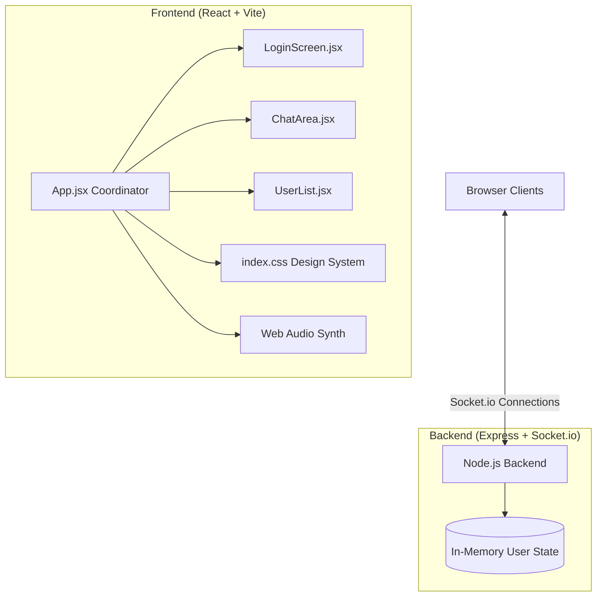

# RealTalk 💬

RealTalk is a sleek, hyper-professional, real-time communication workspace. Designed to mimic production-grade SaaS environments (like Linear, Vercel, and Telegram Dark), the application offers instant message exchange, status synchronizations, credentials authentication, and responsive layout styling.

---

## ⚡ Key Highlights & Features

* 🔐 **Secure REST Credentials API**: Fully custom registration and authentication flows (Sign In / Sign Up toggles) supported by an in-memory database.
* 🛰️ **WebSocket Real-Time Engine**: Powered by Socket.io, enabling instantaneous message broadcasting, user-level join/leave announcements, and delivery receipts.
* ✍️ **Dynamic Typing States**: Real-time detection and visual indication when users are drafting messages.
* 🟢 **Active Sessions List**: Slide-out drawer tracking active users currently online.
* 🎵 **Synthetic Audio Signals**: Custom chime indicators synthesized dynamically via the browser Web Audio API for message dispatches and receptions.
* 📱 **Mobile-Optimized Viewport**: Responsive card layout displaying a modern smartphone frame on desktops that dynamically scales to full-bleed on mobile viewports.
* 🎨 **SaaS-Style Design System**: Hand-coded dark graphite canvas layout featuring solid panels, thin border guidelines, and sleek Off-white typography.

---

## 🛠️ Technology Stack

| Layer | Technologies |
| :--- | :--- |
| **Frontend** | React 19, Vite, Vanilla CSS, Lucide Icons, Web Audio API |
| **Backend** | Node.js, Express, Socket.io, CORS |
| **Deployment** | Git, Monorepo Build Scripts, Render static/relay unified hosting |

---

## 🏗️ Architecture Design



---

## 🚀 Getting Started

### Local Installation

1. Clone the repository:
   ```bash
   git clone <YOUR_GITHUB_REPO_URL>
   cd realtalk-chat
   ```
2. Run the bootstrap setup to install root, frontend, and backend packages:
   ```bash
   npm run setup
   ```
3. Run the development environments concurrently (React on port 5173, Socket.io on port 3001):
   ```bash
   npm run dev
   ```
4. Access the web app at **[http://localhost:5173](http://localhost:5173)**. Open multiple tabs to test the real-time flows.
   * *Pre-loaded admin credentials:* Username: `admin` | Password: `password123`

---

## 🌐 Production Deployment

The project features a **unified production build** config. When deployed, the Express server builds and serves the compiled static React files from the same port. This allows the entire application to run inside a single cloud hosting slot, avoiding CORS limitations.

### Deploying to Render (Free Tier)
1. Link your GitHub repository to a new **Web Service** on **Render**.
2. Configure settings:
   - **Environment**: `Node`
   - **Build Command**: `npm run build`
   - **Start Command**: `npm start`
3. Select the **Free** instance tier and deploy.
